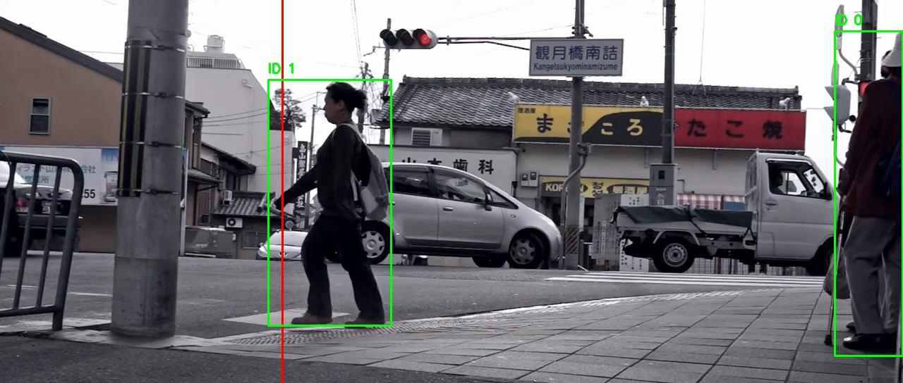
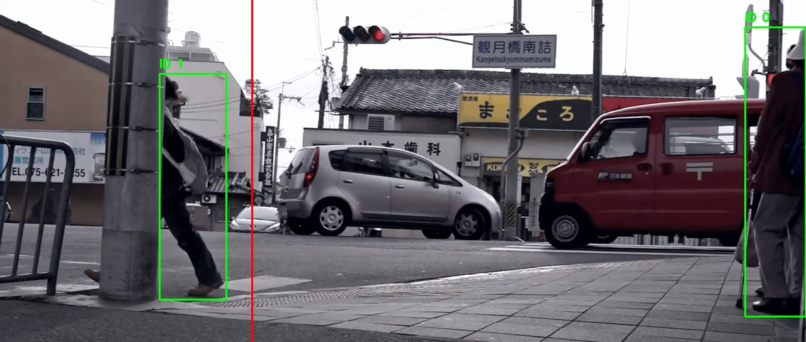
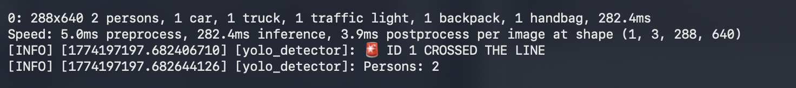

# 🎯 ROS2 People Detection & Line Crossing Pipeline

A containerized computer vision pipeline built with **ROS2**, **YOLOv8**, and **Docker** that performs real-time people detection, multi-object tracking with persistent IDs, and event detection when tracked individuals cross a configurable vertical boundary line.

---

## 📽️ Demo

| Before crossing | After crossing |
|:-:|:-:|
|  |  |

> *Green bounding boxes = tracked persons with persistent ID. Red vertical line = crossing boundary. When an ID crosses right→left, the event is logged to console.*

**Console output:**



---

## 🏗️ Architecture

Two ROS2 nodes communicate via a publisher/subscriber pattern inside a Docker container:

```
┌──────────────────────────┐     /camera/image_raw        ┌──────────────────────────┐
│      camera_publisher    │   ─────────────────────────▶ │      yolo_detector       │
│                          │                              │                          │
│  Reads test.mp4          │                              │  YOLOv8 detection        │
│  Publishes frames @10Hz  │                              │  Centroid-based tracking │
│                          │                              │  Line crossing detection │
└──────────────────────────┘                              └──────────┬───────────────┘
                                                                     │ /detections
                                                                     │ (std_msgs/String)
                                                                     ▼
                                                             JSON payload + console log
                                                             + frame saved to /output
```

## 📁 Project Structure

```
.
├── docker-compose.yml
├── test.mp4                        # Input video (place here)
├── output/                         # Annotated frames saved here
└── src/
    ├── camera_node/
    │   ├── package.xml
    │   ├── setup.py
    │   ├── resource/
    │   │   └── camera_node
    │   └── camera_node/
    │       └── video_camera_publisher.py
    └── detection_node/
        ├── package.xml
        ├── setup.py
        ├── resource/
        │   └── detection_node
        └── detection_node/
            └── yolo_detector.py
```

---

## 🚀 Getting Started

### Prerequisites

- [Docker](https://docs.docker.com/get-docker/) & Docker Compose
- A video file with pedestrian footage — rename it `test.mp4` and place it in the repo root

### 1. Clone the repository

```bash
git clone https://github.com/<your-username>/<repo-name>.git
cd <repo-name>
```

### 2. Start the container

```bash
docker compose run --rm dev
```

This drops you into a bash shell inside the container, with the repo mounted at `/workspace`.

### 3. Install ROS2 and dependencies

Inside the container:

```bash
# Install ROS2 Humble
apt update && apt install -y ros-humble-desktop python3-colcon-common-extensions

# Install Python dependencies
pip install ultralytics opencv-python numpy
```

### 4. Build the ROS2 workspace

```bash
cd /workspace
source /opt/ros/humble/setup.bash
colcon build
source install/setup.bash
```

### 5. Run the nodes

Open **two terminals** inside the container (or use `tmux`):

**Terminal 1 — Camera Publisher:**
```bash
source /opt/ros/humble/setup.bash && source install/setup.bash
ros2 run camera_node video_camera_publisher
```

**Terminal 2 — YOLO Detector:**
```bash
source /opt/ros/humble/setup.bash && source install/setup.bash
ros2 run detection_node yolo_detector
```

Annotated frames are saved to `/workspace/output/` every 10 frames.

---

## ⚙️ Configuration

Parameters are currently hardcoded in the source files. Key values to adjust:

| Parameter | File | Default | Description |
|---|---|---|---|
| Video path | `video_camera_publisher.py` | `/workspace/test.mp4` | Input video (or `0` for webcam) |
| Publish rate | `video_camera_publisher.py` | `0.1s` (10 Hz) | Timer interval |
| YOLO model | `yolo_detector.py` | `yolov8n.pt` | Model variant (n/s/m/l/x) |
| Crossing line X | `yolo_detector.py` | `400` px | Horizontal position of the red line |
| Tracking threshold | `yolo_detector.py` | `50` px | Max centroid distance to match same ID |
| Frame save interval | `yolo_detector.py` | every `10` frames | Output frame frequency |

---

## 🧠 How It Works

### Node 1 — `camera_publisher`

Reads `test.mp4` frame by frame using OpenCV and publishes each frame on `/camera/image_raw` as a `sensor_msgs/Image` message (encoding: `bgr8`). When the video ends, it loops back to frame 0.

### Node 2 — `yolo_detector`

Subscribes to `/camera/image_raw` and processes each frame through 4 stages:

1. **Detection** — YOLOv8n inference, filtering for class `0` (person). Extracts bounding boxes in `xyxy` format.

2. **Tracking** — Custom centroid tracker: for each detected centroid, searches existing tracks within 50px Euclidean distance. Matched detections keep their ID; unmatched ones are assigned a new incremental ID. Tracked persons get **green** bounding boxes, new detections get **blue**.

3. **Event Detection** — Monitors the X position of each centroid across frames. When an ID moves from `x > 400` to `x ≤ 400` (right→left crossing), it fires once per ID:
   ```
   🚨 ID 1 CROSSED THE LINE
   ```

4. **Output** — Draws the red vertical line and all bounding boxes on the annotated frame, saves a JPG every 10 frames to `/workspace/output/`, and publishes a JSON summary on `/detections`:
   ```json
   {"num_person": 3}
   ```

---

## 🛠️ Dependencies

| Package | Purpose |
|---|---|
| ROS2 Humble | Node communication framework |
| `ultralytics` | YOLOv8 inference |
| `opencv-python` | Frame reading, drawing, saving |
| `numpy` | Frame buffer conversion |